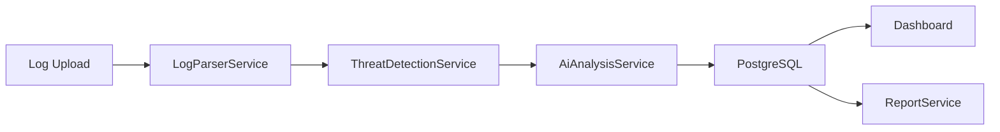

# Architecture

```mermaid
flowchart LR
    A["Log Upload"] --> B["LogParserService"]
    B --> C["ThreatDetectionService"]
    C --> D["AiAnalysisService"]
    D --> E["PostgreSQL"]
    E --> F["Dashboard"]
    E --> G["ReportService"]
```
